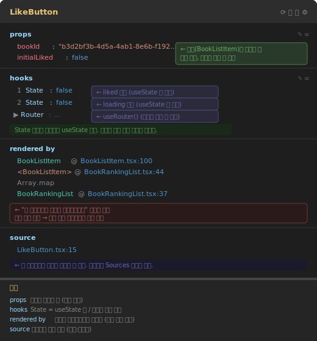

# React DevTools 사용법

> 설치: Chrome/Edge 확장 프로그램에서 "React Developer Tools" 설치

---

## 언제 여는가

평소 개발할 때는 안 열어도 된다. 아래 상황이 생겼을 때 연다.

| 상황 | 쓰는 탭 | 확인하는 것 |
|------|---------|-----------|
| "버튼 눌렀는데 화면이 왜 안 바뀌지?" | Components | hooks에서 state 값이 바뀌었는지 |
| "이 컴포넌트 props로 뭐가 오는 거지?" | Components | props 항목 |
| "필터 클릭할 때 왜 이렇게 느리지?" | Profiler | Ranked에서 ms 확인 |
| "클릭했는데 왜 이렇게 많이 렌더링되지?" | Profiler | Why did this render? |
| "이 컴포넌트 어디서 쓰이는 거지?" | Components | rendered by |

**본격적으로 쓰는 시점:** Phase 6 성능 최적화 (Day 58~)
지금 Phase 1에서는 "렌더링이 언제 일어나는지 눈으로 확인"하는 용도로만 쓴다.

---

## 설정 먼저 — 이것만 켜두면 된다

### Components 탭 설정 (⚙️)

**`Highlight updates when components render`** ← 가장 유용

컴포넌트가 렌더링될 때마다 화면에 파란 테두리가 번쩍인다.
코드를 안 봐도 "지금 뭐가 렌더링됐는지" 눈으로 바로 확인 가능하다.

```
⚙️ → General → ✅ Highlight updates when components render
```

---

### Profiler 탭 설정 (⚙️)

**`Record why each component rendered while profiling`** ← 필수

이걸 켜야 "왜 렌더링됐는지" 이유가 표시된다. 기본값이 꺼져있다.

```
⚙️ → Profiler → ✅ Record why each component rendered while profiling
```

---

## Components 탭 — 컴포넌트 트리 읽기

### 기본 사용법

```
1. DevTools 열기 → Components 탭 클릭
2. 페이지에서 컴포넌트 클릭 또는
   DevTools에서 컴포넌트 이름 클릭
3. 오른쪽 패널에서 props / state / hooks 확인
```

### 오른쪽 패널 읽는 법



**props** — 부모가 내려준 값. 읽기 전용.
```
bookId:       "b3d2bf3b-..."   ← BookListItem이 내려준 값
initialLiked: false
```

**hooks** — `useState`, `useEffect`, `useRouter` 등 이 컴포넌트가 쓰는 훅 전부.
"State" 섹션이 따로 없고 hooks 안에 함께 표시된다.
```
1 State: false    ← 코드에서 첫 번째 useState → liked
2 State: false    ← 두 번째 useState → loading
▶ Router: …      ← useRouter() (클릭하면 내부 값 펼쳐짐)
```
번호는 코드에 등장하는 순서. 커스텀 훅은 이름 그대로 보인다.

**rendered by** — 이 컴포넌트가 어디서 렌더링됐는지 역방향 추적.
```
BookListItem     @ BookListItem.tsx:100    ← 직접 부모
<BookListItem>   @ BookRankingList.tsx:44  ← 그 위 부모
Array.map                                  ← 반복문으로 렌더링됨
BookRankingList  @ BookRankingList.tsx:37
```
파란 링크를 클릭하면 해당 파일 소스코드로 바로 이동한다.

**source** — 이 컴포넌트가 정의된 파일과 줄 번호.
```
LikeButton.tsx:15
```

### 활용 예시 — state 값 실시간 확인

```
1. Components 탭에서 LikeButton 클릭
2. hooks 항목 확인 → 1 State: false (liked), 2 State: false (loading)
3. 화면에서 하트 버튼 클릭
4. hooks → 2 State: true (loading, API 호출 중)
5. API 응답 오면 → 1 State: true, 2 State: false
```

이걸 보면 "버튼 클릭 → state 변화 → 렌더링" 흐름이 눈에 보인다.

---

## Profiler 탭 — 렌더링 성능 측정

### 기본 흐름

```
1. ● Record 클릭 (녹화 시작)
2. 측정하고 싶은 동작 수행 (버튼 클릭, 입력 등)
3. ■ Stop 클릭 (녹화 종료)
4. Flamegraph에서 결과 확인
```

### Flamegraph 읽는 법

```
색깔
├── 🟡 노란색/주황색 = 렌더링됨 + 오래 걸림
├── 🟩 초록색       = 렌더링됨 + 빠름
└── ⬜ 회색 (빗금)  = 이번 커밋에서 렌더링 안 됨

막대 너비 = 렌더링에 걸린 시간 (넓을수록 느림)
막대 계층 = 컴포넌트 트리 (부모 → 자식 순서)
```

### 커밋 네비게이션

```
1 / 10  ← →
```

숫자 = state가 바뀌어서 DOM이 업데이트된 횟수
화살표로 각 커밋을 이동하며 "이 시점에 뭐가 렌더링됐는지" 확인

### 컴포넌트 클릭 → 오른쪽 패널

```
Why did this render?          ← ⚙️ 설정 켜야 보임
├── Props changed: isOpen
├── Parent component rendered
└── Hooks changed: useState

Rendered at: 1.2s for 6.7ms  ← 전체 시간 중 언제, 얼마나 걸렸는지
```

### Ranked 탭 — 느린 것 순서대로

Flamegraph가 트리 구조라 비교가 어려울 때 사용.
렌더링 시간이 긴 컴포넌트 순서대로 나열해준다.

```
BookListItem  (1.5ms)  ████████████████████████████████  ← 가장 느림
BookListItem  (1.5ms)  ████████████████████████████████
LikeButton    (0.6ms)  ████████████
Anonymous     (0.5ms)  ██████████
Heart         (0.3ms)  ██████
...
```

컴포넌트 클릭 → 오른쪽 패널에서 두 가지를 확인한다.

**Why did this render?** — 렌더링 원인
```
The parent component rendered.   ← 부모가 렌더링돼서 같이 렌더링됨
Props changed: isOpen            ← props가 바뀌어서
Hooks changed: useState          ← 내부 state가 바뀌어서
```

**Rendered at** — 이 컴포넌트가 몇 번 렌더링됐는지 목록으로 표시
```
0.8s for 3.6ms   ← (선택된 커밋) 페이지 열리고 0.8초 시점, 3.6ms 걸림
1.4s for 3.8ms   ← 같은 컴포넌트가 다시 렌더링된 시점
2.0s for 17.1ms  ← 세 번째 렌더링, 17ms로 가장 오래 걸림 ← 여기가 문제
```
목록에서 각 항목 클릭하면 그 시점의 Flamegraph로 이동한다.

```
Flamegraph → 트리 구조, 어떤 자식들이 같이 렌더링됐는지 보기 좋음
Ranked     → 순위 구조, 어떤 컴포넌트가 가장 느린지 찾을 때 좋음
```

---

## 실습 시나리오 — 이 프로젝트에서 확인하기

### 시나리오 1: 알림 드롭다운 렌더링 추적

```
목표: 알림 버튼 클릭 시 무엇이 렌더링되는지 확인

1. Components 탭 → ⚙️ → Highlight updates 켜기
2. 알림 버튼 클릭 → 파란 테두리 번쩍이는 컴포넌트 확인
3. Profiler → ⚙️ → Record why... 켜기
4. Record → 알림 버튼 클릭 → Stop
5. NotificationDropdown 클릭 → "Why did this render?" 확인
```

예상 결과:
```
NotificationDropdown → Hooks changed (isOpen state)
NotificationList     → Parent component rendered
NotificationItem × N → Parent component rendered
```

### 시나리오 2: 불필요한 렌더링 찾기

```
목표: 알림 드롭다운 열 때 관계없는 컴포넌트가 렌더링되는지 확인

1. Highlight updates 켜기
2. 알림 버튼 클릭
3. HeaderClient 외부(BookRankingList 등)에 테두리가 뜨는지 확인
   → 뜨면 불필요한 렌더링
   → 안 뜨면 잘 분리된 것
```

---

## 자주 보는 "Why did this render?" 메시지

| 메시지 | 의미 |
|--------|------|
| `Props changed` | 부모가 다른 props를 넘겨줬다 |
| `Parent component rendered` | 부모가 렌더링돼서 자동으로 같이 렌더링됨 |
| `Hooks changed` | useState/useContext 등 훅 값이 바뀌었다 |
| `Did not render` | 이번 커밋에서 렌더링 안 됨 (회색 빗금) |
