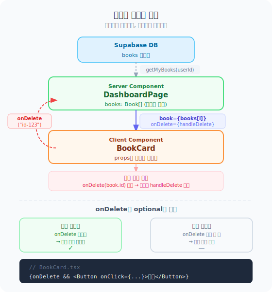

# Day 01 — 단방향 데이터 흐름 (Unidirectional Data Flow)


> **Phase 1 | 2026-03-23 | 30분**
> 연결 코드: `features/book/ui/BookCard.tsx` · `widgets/book/ui/BookListItem.tsx`

---

## 핵심 개념
> **데이터는 내려가고, 이벤트는 올라간다.**




React에서 데이터는 **항상 부모 → 자식 방향**으로만 흐른다.
자식이 부모에게 무언가를 전달하려면 **부모가 내려준 콜백 함수**를 호출해야 한다.

```
부모 ──(props)──▶ 자식   ← 데이터 방향
부모 ◀──(콜백)── 자식   ← 이벤트 방향
```

---

## 코드로 보기

### BookCard — props를 받아서 렌더링만 한다

```tsx
// features/book/ui/BookCard.tsx

type BookCardProps = {
  book: Book;                       // ← 부모가 내려주는 데이터
  onDelete?: (id: string) => void;  // ← 부모가 내려주는 콜백
};

export const BookCard = ({ book, onDelete }: BookCardProps) => {
  return (
    <Card>
      <h3>{book.title}</h3>        {/* book을 그대로 표시 */}
      <p>{book.author}</p>

      {/* onDelete가 있을 때만 삭제 버튼 표시 */}
      {onDelete && (
        <Button onClick={() => onDelete(book.id)}>
          삭제
        </Button>
      )}
    </Card>
  );
};
```

**BookCard는 `book`이 어디서 왔는지 모른다.**
Supabase든, 더미 데이터든, 테스트 목 데이터든 — props로 받은 것만 렌더링한다.

---

## 오늘의 질문 & 답

### Q1. BookListItem이 `GlobalBook | Book` 둘 다 받는 이유는 필요한 데이터가 각각 있어서?

**정답에 가깝다. 정확히는 "같은 UI를 두 다른 데이터 출처에서 재사용하기 위해서"다.**

```
내 서재 페이지 ─────── Book 타입 ──────▶ BookListItem
공개 도서 페이지 ─── GlobalBook 타입 ──▶ BookListItem
랭킹 리스트 ─────── GlobalBook 타입 ──▶ BookListItem
```

`Book`에는 `status`, `rating`, `tags` 같은 **내 독서 기록** 필드가 있고,
`GlobalBook`에는 `category`, `pub_date` 같은 **책 자체 정보**만 있다.

둘 다 `title`, `author`, `cover_image`, `spine_image`는 공통이라
같은 책장 UI 컴포넌트로 렌더링할 수 있다.

```tsx
// BookListItem.tsx 내부
const isRead = isReadProp || (book as any).status === 'completed';
//                           ↑ Book 타입이면 status가 있고,
//                             GlobalBook이면 없어서 isReadProp에 의존
```

`isReadProp`을 부모가 내려주는 이유: **GlobalBook에는 내가 읽었는지 모른다.**
부모(공개 도서 페이지)가 "내가 읽은 ISBNs 목록"을 미리 조회해서 `isReadProp`으로 전달한다.

```tsx
// 공개 도서 페이지 (부모)
const myReadIsbns = await getMyReadIsbns(userId);

books.map(book => (
  <BookListItem
    book={book}
    isReadProp={myReadIsbns.includes(book.isbn)}  // ← 부모가 계산해서 전달
  />
))
```

---

### Q2. `onDelete`가 없어도 사용 가능해야 해서 optional?

**정확하다.** `BookCard`가 쓰이는 맥락이 두 가지다:

| 맥락 | onDelete 필요? | 이유 |
|------|---------------|------|
| 내 서재 목록 페이지 | ✅ 필요 | 삭제 버튼 있어야 함 |
| 책 상세 페이지 | ❌ 불필요 | 상세 보기에는 삭제 버튼 없어도 됨 |

```tsx
// 내 서재 목록에서 → onDelete 전달
<BookCard book={book} onDelete={handleDelete} />

// 상세 페이지에서 → onDelete 생략 가능
<BookCard book={book} />
```

코드 안에서도 이렇게 처리한다:

```tsx
{onDelete && (          // ← onDelete가 있을 때만
  <Button onClick={() => onDelete(book.id)}>
    삭제
  </Button>
)}
```

**optional props 패턴의 핵심:**
같은 컴포넌트를 "기능이 있는 버전"과 "없는 버전" 두 곳에서 재사용할 수 있다.
조건부 렌더링으로 UI도 자동으로 맞춰진다.

---

## 오늘 배운 것 정리

| 개념 | 설명 |
|------|------|
| **단방향 흐름** | 데이터는 부모 → 자식으로만 (props) |
| **콜백으로 역방향** | 자식이 부모에게 알리려면 콜백 호출 |
| **자식의 무지** | 자식은 데이터 출처를 모른다 (테스트 용이) |
| **Union type props** | 같은 UI, 다른 데이터 → 재사용성 ↑ |
| **Optional props** | 같은 컴포넌트, 다른 맥락 → 재사용성 ↑ |

---

## 실습 — 코드에서 직접 찾아보기

### 1. props 내려주기

```tsx
// app/(protected)/books/all/page.tsx
{books.map((book) => (
  <BookListItem
    key={book.id}
    book={book}                              // ← 책 데이터 내려줌
    isReadProp={myReadIsbns.has(book.isbn)}  // ← 읽었는지 여부 내려줌
    isLikedProp={myLikedIds.has(book.id)}    // ← 좋아요 여부 내려줌
  />
))}
```

### 2. 콜백 올리기

```tsx
// 부모 (DashboardContent)
const handleDelete = async (id: string) => {
  await deleteBook(id);  // 실제 삭제는 부모가 한다
};

<BookCard book={book} onDelete={handleDelete} />

// 자식 (BookCard) → 삭제 버튼 클릭 시
<Button onClick={() => onDelete(book.id)}>삭제</Button>
//                      ↑ 부모의 handleDelete가 실행됨
```

---

## 내일 예고

**Day 02 — 상태 끌어올리기**
책장 탭 선택 상태가 어디에 있어야 하는지 파악하고,
두 컴포넌트가 같은 상태를 공유해야 할 때 올려야 하는 이유를 배운다.
