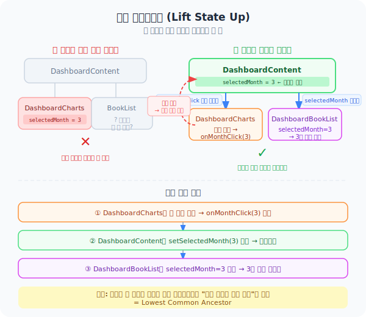

# Day 02 — 상태 끌어올리기 (Lift State Up)

> Phase 1 | 2026-03-24
> 연결 코드: `widgets/dashboard/DashboardContent.tsx` · `features/stats/ui/DashboardCharts.tsx` · `features/stats/ui/DashboardBookList.tsx`

---

## 핵심 개념

> **두 컴포넌트가 같은 상태를 공유해야 한다면, 그 상태를 공통 부모로 올린다.**



---

## 왜 끌어올려야 하는가

대시보드에서 **월별 차트를 클릭하면 아래 책 목록이 필터링**된다.

```
DashboardCharts  ──(월 클릭)──▶  DashboardBookList
```

이 두 컴포넌트는 **형제 관계**다. React에서 형제끼리는 직접 통신할 수 없다.
`selectedMonth` 상태를 둘 중 하나에 넣으면 다른 쪽이 접근할 수 없다.

**해결책**: 두 컴포넌트의 공통 부모인 `DashboardContent`로 상태를 올린다.

---

## 실제 코드

### 부모 — 상태를 들고 있는 곳

```tsx
// widgets/dashboard/DashboardContent.tsx
export const DashboardContent = ({ ... }) => {

  // ↓ 두 자식이 공유하는 상태를 여기서 관리
  const [selectedMonth, setSelectedMonth] = useState<number | null>(null);
  const [selectedCategory, setSelectedCategory] = useState<string | null>(null);
  const [selectedRating, setSelectedRating] = useState<number | null>(null);

  const handleMonthClick = (month: number) => {
    setSelectedMonth((prev) => (prev === month ? null : month)); // 토글
  };

  return (
    <>
      {/* 차트에게는 콜백을 내려줌 */}
      <DashboardCharts
        onMonthClick={handleMonthClick}
        onRatingClick={handleRatingClick}
      />

      {/* 책 목록에게는 상태 값을 내려줌 */}
      <DashboardBookList
        selectedMonth={selectedMonth}
        selectedCategory={selectedCategory}
        selectedRating={selectedRating}
      />
    </>
  );
};
```

### 자식 A — 이벤트를 올리는 쪽 (DashboardCharts)

```tsx
// features/stats/ui/DashboardCharts.tsx
type Props = {
  onMonthClick: (month: number) => void;  // ← 부모에게서 받은 콜백
  onRatingClick: (rating: number) => void;
};

// 월 막대 클릭 → 부모의 setSelectedMonth 실행됨
<Bar onClick={(data) => onMonthClick(data.month)} />
```

### 자식 B — 상태를 받아서 쓰는 쪽 (DashboardBookList)

```tsx
// features/stats/ui/DashboardBookList.tsx
type Props = {
  selectedMonth: number | null;   // ← 부모에게서 받은 상태
  selectedCategory: string | null;
  selectedRating: number | null;
};

// 받은 상태로 책 목록 필터링
const filteredBooks = books.filter((book) => {
  if (selectedMonth !== null) {
    const bookMonth = new Date(book.completed_date).getMonth() + 1;
    if (bookMonth !== selectedMonth) return false;
  }
  // ...
});
```

---

## 흐름 정리

```
① 사용자가 차트의 "3월" 막대 클릭
② DashboardCharts → onMonthClick(3) 호출
③ DashboardContent → setSelectedMonth(3) 실행
④ DashboardContent 리렌더링
⑤ DashboardBookList → selectedMonth=3 받음 → 3월 책만 표시
```

---

## 상태를 어디에 둘지 결정하는 기준

| 상황 | 상태 위치 |
|------|----------|
| 한 컴포넌트만 사용 | 그 컴포넌트 안 |
| 두 형제 컴포넌트가 공유 | 공통 부모로 올리기 |
| 앱 전체에서 공유 | Context 또는 전역 상태 |

> **공통 부모 = 두 컴포넌트를 모두 포함하는 가장 가까운 조상**

---

## 오늘의 핵심 한 문장

> **상태는 그 상태를 필요로 하는 컴포넌트들의 가장 가까운 공통 부모에 둔다.**

---

## 다음 시간 예고

**Day 03 — 파생 상태 vs 독립 상태**
`filteredBooks`를 `useState`로 따로 관리할 필요가 없는 이유.
계산할 수 있는 값을 state로 만들면 생기는 문제.
