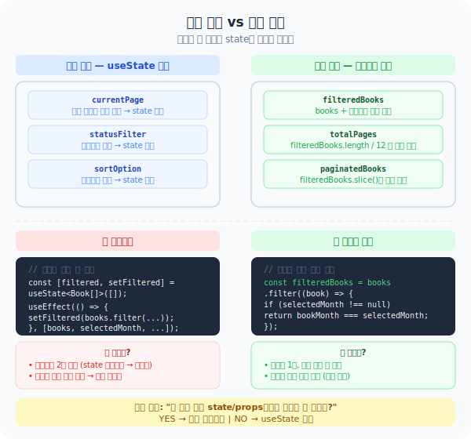

# Day 03 — 파생 상태 vs 독립 상태

> Phase 1 | 2026-03-21
> 연결 코드: `features/stats/ui/DashboardBookList.tsx`

---

## 핵심 개념

> **계산할 수 있는 값은 state로 만들지 않는다. 렌더링 중에 바로 계산한다.**



---

## 뭐가 state고, 뭐가 파생인가?

```
state가 되는 것
├── 사용자 상호작용으로 결정되는 값  → 클릭, 입력, 선택
└── 서버 / 외부에서 받아온 데이터   → books, user 정보 등

파생 상태가 되는 것
└── 위의 state들로 계산할 수 있는 모든 것
```

### 장바구니 예시

```tsx
// ✅ state — 사용자가 직접 담은 것 (상호작용)
const [cart, setCart] = useState([
  { name: "셔츠", price: 30000 },
  { name: "바지", price: 50000 },
]);

// ✅ 파생 — cart로 계산 가능, state 필요 없음
const totalPrice = cart.reduce((sum, item) => sum + item.price, 0); // 80000
const itemCount  = cart.length;                                       // 2
```

`totalPrice`를 `useState`로 따로 관리하면?

```tsx
// ❌ 안티패턴
const [totalPrice, setTotalPrice] = useState(0);

const addItem = (item) => {
  setCart([...cart, item]);
  setTotalPrice(totalPrice + item.price); // 깜빡하면 금액 버그
};
```

cart를 바꿀 때 totalPrice도 맞춰줘야 하는데, **실수로 빠뜨리면 화면에 틀린 금액이 표시된다.**
그냥 `const totalPrice = cart.reduce(...)` 한 줄이면 **항상 정확하다.**

---

## 실제 코드 — DashboardBookList.tsx

```tsx
// ✅ 독립 상태 (state) — 사용자가 직접 선택
const [currentPage, setCurrentPage] = useState(1);
const [statusFilter, setStatusFilter] = useState<BookStatus | 'all'>('all');
const [sortOption, setSortOption]     = useState<string>('created_at-desc');

// ✅ 파생 상태 — books + 필터들로 계산 (useState 없음)
const filteredBooks  = books.filter(...).sort(...);
const totalPages     = Math.ceil(filteredBooks.length / BOOKS_PER_PAGE);
const paginatedBooks = filteredBooks.slice(startIndex, endIndex);
```

```
books (서버 데이터)  +  statusFilter, selectedMonth, ... (사용자 선택)
           ↓ 계산
filteredBooks  → 파생 (state 불필요)
totalPages     → 파생 (state 불필요)
paginatedBooks → 파생 (state 불필요)

currentPage   → 사용자가 버튼 눌러야 알 수 있음 → state
statusFilter  → 사용자가 선택해야 알 수 있음   → state
```

---

## 판단 기준 한 문장

> **"이미 있는 값들로 계산할 수 있는가?"**
> YES → 그냥 계산  |  NO → useState

---

## 왜 나누는가

state를 2개 관리하면 둘이 **어긋날 수 있다.**
하나의 데이터에서 나머지를 계산하면 **항상 일치가 보장된다.**

---

## 다음 시간 예고

**Day 04 — 파생 상태 실습**
`DashboardBookList`의 필터 로직을 직접 읽으며 파생 상태를 더 찾아보고,
`entities/book/` model 레이어에서 재사용 가능한 계산 함수를 확인한다.
