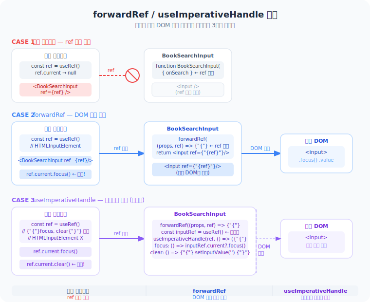

# Day 18 — ref 전달: forwardRef (React ≤18) → ref as prop (React 19)

## 오늘 읽을 코드

- [BookSearchInput.tsx (features/book)](../apps/page0127/src/features/book/ui/BookSearchInput.tsx)
- [BookSearchInput.tsx (features/stats)](../apps/page0127/src/features/stats/ui/BookSearchInput.tsx)

---

## 도식: ref가 어떻게 흘러가는가



---

## 핵심 개념

### React 18 이하 — forwardRef 필수

```tsx
// ref는 예약어 → 일반 prop으로 못 받음 → HOC로 감싸야 했음
const BookSearchInput = forwardRef<HTMLInputElement, BookSearchInputProps>(
  ({ onSearch }, ref) => {           // 두 번째 인자로 ref 수신
    return <Input ref={ref} ... />;
  }
);
BookSearchInput.displayName = 'BookSearchInput'; // DevTools용
```

### React 19 — ref를 일반 prop으로

```tsx
// ref가 children처럼 기본 prop으로 승격됨
type BookSearchInputProps = {
  onSearch: (query: string) => void;
  ref?: React.Ref<HTMLInputElement>; // props 타입에 그냥 추가
};

export const BookSearchInput = ({ onSearch, ref }: BookSearchInputProps) => {
  return <Input ref={ref} ... />;  // 그대로 넘기면 됨
};
// forwardRef, displayName 불필요
```

**사용하는 쪽은 동일:**
```tsx
const searchRef = useRef<HTMLInputElement>(null);
useEffect(() => { searchRef.current?.focus(); }, []);

<BookSearchInput ref={searchRef} onSearch={handleSearch} />
```

---

### useImperativeHandle — React 19에서도 그대로

메서드만 선택 노출이 필요할 때. forwardRef만 사라졌고 패턴은 동일하다.

```tsx
export type BookSearchInputHandle = { focus: () => void; clear: () => void };

type BookSearchInputProps = {
  onSearchChange: (query: string) => void;
  ref?: React.Ref<BookSearchInputHandle>; // DOM 타입 대신 핸들 타입
};

export const BookSearchInput = ({ onSearchChange, ref }: BookSearchInputProps) => {
  const inputRef = useRef<HTMLInputElement>(null); // 내부 전용 DOM ref

  useImperativeHandle(ref, () => ({
    focus: () => inputRef.current?.focus(),
    clear: () => { setInputValue(''); onSearchChange(''); },
  }));

  return <Input ref={inputRef} ... />;
};
```

---

## 정리 표

| | React ≤ 18 | React 19 (현재 프로젝트) |
|--|-----------|------------------------|
| DOM ref 전달 | `forwardRef` 필수 | ref를 prop으로 바로 받음 |
| 메서드 노출 | `forwardRef` + `useImperativeHandle` | `useImperativeHandle`만 (forwardRef 제거) |
| 내부에서만 DOM 접근 | `useRef` | `useRef` (변화 없음) |
| `forwardRef` 상태 | 정상 | deprecated (하위호환 유지) |

**규칙:** React 19에서 ref는 그냥 prop이다. `forwardRef`는 이제 쓰지 않는다.

---

## 오늘 실험 (React 19 방식으로 구현)

1. **자동 포커스**: `books/add` 페이지 진입 시 `ref` prop으로 받은 `BookSearchInput` 자동 포커스
2. **clear 메서드**: `useImperativeHandle`로 `clear()` 노출 → 대시보드 "초기화" 버튼 연결

---

## 다음 Day 예고

**Day 19 — useMemo: 비싼 계산 캐싱**
- 렌더마다 반복되는 필터/정렬 연산을 `useMemo`로 최적화
- page0127의 도서 목록 필터링에 적용
