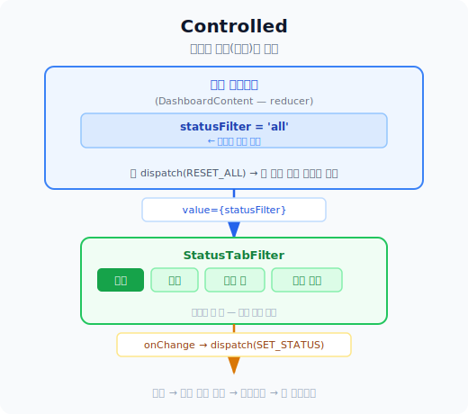
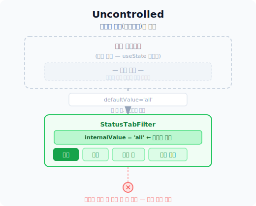

# Day 32 — Compound Component 심화: controlled / uncontrolled 모드

> 날짜: 2026-04-13 | 주제: 내부 상태 vs 외부 상태, 두 모드 지원

---

## 1. 오늘 읽을 코드

- [StatusTabFilter.tsx](../apps/page0127/src/shared/ui/StatusTabFilter.tsx) — 오늘 직접 만든 controlled Compound Component
- [DashboardBookList.tsx](../apps/page0127/src/features/stats/ui/DashboardBookList.tsx#L278) — StatusTabFilter를 controlled 모드로 사용하는 곳

---

## 2. 핵심 개념

### controlled vs uncontrolled

React에서 input에만 있는 개념이 아니다. 모든 상태를 가진 컴포넌트에 적용된다.

---

#### Controlled — 상태가 바깥에 있다



**장점**
- 부모가 언제든 상태를 읽고, 강제로 바꿀 수 있다
- `RESET_ALL` 같은 일괄 초기화 가능
- 차트 클릭 → 탭 자동 이동 같은 외부 연동 쉬움
- 상태가 한 곳에 모여 있어 디버깅 편함

**단점**
- 사용하는 쪽에서 `value` + `onChange` + `useState`를 직접 만들어야 함
- 코드가 길어짐 — 단순한 UI에 쓰기엔 과함

---

#### Uncontrolled — 상태가 안에 있다



**장점**
- 사용하는 쪽이 단순 — `defaultValue`만 넘기면 끝
- 부모에 `useState` 불필요, 보일러플레이트 줄어듦
- 독립적인 UI 조각으로 어디서나 가져다 쓰기 좋음

**단점**
- 부모가 현재 값을 모른다 → 외부에서 리셋 불가
- 차트나 URL 파라미터와 연동하려면 구조를 바꿔야 함

---

| | controlled | uncontrolled |
|---|---|---|
| 상태 위치 | **바깥 (부모)** | **안쪽 (컴포넌트 내부)** |
| 사용 방법 | `value` + `onChange` 필수 | `defaultValue`만 넘기면 됨 |
| 외부 리셋 | ✅ 가능 | ❌ 불가 |
| 외부 연동 | ✅ 자유롭게 | ❌ 어렵 |
| 코드 양 | 많음 | 적음 |
| 언제 | 부모가 상태를 알아야 할 때 | 완전히 독립 동작할 때 |

### 두 모드를 모두 지원하는 패턴

```tsx
type StatusTabFilterProps = {
  // controlled: 두 개 같이 넘기면 외부 상태 사용
  value?: StatusValue;
  onChange?: (value: StatusValue) => void;
  // uncontrolled: 초기값만 넘기면 내부 상태 사용
  defaultValue?: StatusValue;
  children: React.ReactNode;
};

export const StatusTabFilter = ({
  value,           // controlled용
  onChange,        // controlled용
  defaultValue = 'all', // uncontrolled 초기값
  children,
}: StatusTabFilterProps) => {
  // uncontrolled용 내부 상태
  const [internalValue, setInternalValue] = useState(defaultValue);

  // value가 있으면 controlled, 없으면 internal 사용
  const activeValue = value ?? internalValue;

  const handleChange = (next: StatusValue) => {
    if (value === undefined) {
      // uncontrolled: 내부 상태 변경
      setInternalValue(next);
    }
    // 두 모드 모두: onChange가 있으면 항상 호출
    onChange?.(next);
  };

  return (
    <StatusTabFilterContext.Provider value={{ activeValue, onChange: handleChange }}>
      <div className='mb-6 flex flex-wrap gap-2'>{children}</div>
    </StatusTabFilterContext.Provider>
  );
};
```

---

## 3. page0127 실제 코드 사례

### controlled 모드 — DashboardBookList (현재 구현)

```tsx
// DashboardBookList.tsx:278
// statusFilter는 부모 reducer가 관리 → RESET_ALL 한 방에 초기화 가능
<StatusTabFilter
  value={statusFilter}         // controlled: 부모 상태를 그대로 표시
  onChange={handleStatusChange} // controlled: 부모 상태를 변경
  isPending={isTabPending}
>
  <StatusTabFilter.Tab value='all'>전체</StatusTabFilter.Tab>
  <StatusTabFilter.Tab value='completed'>완독</StatusTabFilter.Tab>
  <StatusTabFilter.Tab value='reading'>읽는 중</StatusTabFilter.Tab>
  <StatusTabFilter.Tab value='want_to_read'>읽고 싶은</StatusTabFilter.Tab>
</StatusTabFilter>
```

**왜 controlled를 선택했나**: `DashboardContent`의 `RESET_ALL` dispatch가 `statusFilter`를 포함해서 초기화한다. 상태가 컴포넌트 안에 있으면 RESET_ALL이 닿지 않는다.

### controlled 모드 — PublicLibraryContent (동일 이유)

```tsx
// PublicLibraryContent.tsx:66
const [statusFilter, setStatusFilter] = useState<BookStatus | 'all'>('all');

const resetFilters = () => {
  setStatusFilter('all'); // ← 탭 상태도 여기서 초기화
  setSearchQuery('');
  setSelectedCategory(null);
};

// controlled를 써야 하는 이유: resetFilters가 statusFilter를 직접 'all'로 돌림
<StatusTabFilter value={statusFilter} onChange={setStatusFilter}>
  <StatusTabFilter.Tab value='all'>전체</StatusTabFilter.Tab>
  <StatusTabFilter.Tab value='completed'>완독</StatusTabFilter.Tab>
  ...
</StatusTabFilter>
```

**왜 controlled여야 하나**: `resetFilters`가 `setStatusFilter('all')`을 호출한다. 상태가 컴포넌트 안에 있으면 `resetFilters`가 탭을 초기화할 수 없다. Dashboard와 같은 이유.

---

## 4. 정리 규칙

> **`value`가 있으면 controlled, 없으면 uncontrolled** — `value ?? internalValue` 한 줄이 두 모드를 가른다.

### 실무에서 controlled가 압도적으로 많이 쓰인다

uncontrolled를 써도 되는 경우는 사실상 두 가지뿐:

```
✅ uncontrolled가 맞는 케이스
├── <input type="file">
│     브라우저가 강제로 uncontrolled (value prop 자체가 없음)
│
└── 제출할 때만 값이 필요한 단순 폼
      유효성 검사 없음 + 외부 연동 없음 + 리셋 없음

✅ controlled가 맞는 케이스 (거의 대부분)
├── 입력할 때마다 유효성 검사
├── 리셋 버튼
├── 다른 컴포넌트와 값 동기화
├── URL 파라미터 연동
└── 자동저장
```

`react-hook-form` 같은 라이브러리가 내부적으로 uncontrolled를 쓰는 건  
**리렌더링 최적화** 목적이지, 일반 코드에서 선택할 이유가 아니다.

React 공식 문서도 controlled를 기본으로 권장한다.

### 어떤 모드를 선택할까

- 부모가 상태를 읽거나 직접 변경해야 함 → **controlled**
- 완전히 독립 동작, 리셋도 외부 연동도 없음 → uncontrolled

**이 프로젝트**: Dashboard, PublicLibrary 모두 `resetFilters`가 있어서 둘 다 controlled.

---

## 5. 오늘 실험

**실험 1 — StatusTabFilter에 uncontrolled 모드 추가**

[StatusTabFilter.tsx](../apps/page0127/src/shared/ui/StatusTabFilter.tsx)를 열고 아래 변경을 직접 타이핑:

1. `value`와 `defaultValue`를 모두 optional로 변경
2. 내부 `useState` 추가
3. `activeValue = value ?? internalValue` 로직 추가

```tsx
// 변경 전
type StatusTabFilterProps = {
  value: StatusValue;
  onChange: (value: StatusValue) => void;
  ...
};

// 변경 후
type StatusTabFilterProps = {
  value?: StatusValue;           // optional
  onChange?: (value: StatusValue) => void; // optional
  defaultValue?: StatusValue;    // uncontrolled 초기값
  ...
};
```

**실험 2 — 두 모드 동시에 화면에서 확인**

임시로 같은 페이지에 두 개를 나란히 놓기:

```tsx
{/* controlled: 버튼 클릭으로 외부에서 강제 변경 가능 */}
<button onClick={() => setForceTab('completed')}>완독으로 강제 이동</button>
<StatusTabFilter value={forceTab} onChange={setForceTab}>...</StatusTabFilter>

{/* uncontrolled: 버튼 클릭해도 탭이 안 바뀜 */}
<button onClick={() => setForceTab('completed')}>완독으로 강제 이동 (효과 없음)</button>
<StatusTabFilter defaultValue='all'>...</StatusTabFilter>
```

→ controlled는 외부 버튼으로 탭이 바뀌고, uncontrolled는 바뀌지 않는 것을 눈으로 확인

---

## 6. 다음 Day 예고

**Day 33 — Context**

- `shared/providers/` 레이어에 있는 `AuthContext` 구조 분석
- Context를 언제 쓰고 언제 쓰지 말아야 하는지
- Compound Component의 Context vs 전역 Context 차이
